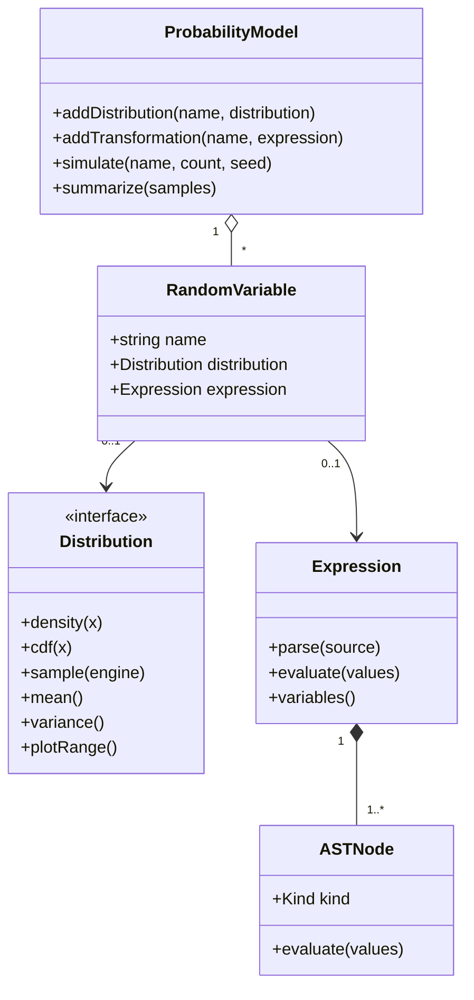
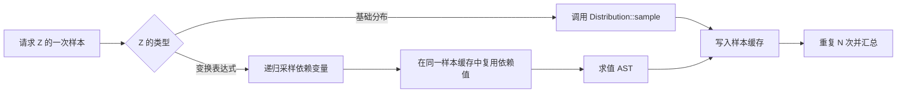

# Stochia 核心架构

## 设计目标

核心层不依赖 Qt。界面只负责收集定义、选择视图和呈现数据；概率对象、表达式求值与模拟均可在命令行测试中运行。这让未来接入 Qt Charts、SymEngine 或 Python 计算后端时，不需要重写变量模型。

## 对象关系



`RandomVariable` 是一个带名称的概率节点。基础变量持有 `Distribution`，变换变量持有 `Expression`；二者互斥。`ProbabilityModel` 维护变量依赖图，在加入定义时拒绝未知依赖和环，并在一次抽样中缓存上游变量，保证同一个样本里的 `X + X` 使用同一次 `X` 抽样。

## 分布层

`Distribution` 接口统一连续和离散分布：

- `density(x)` 对连续变量表示 PDF，对离散变量表示 PMF。
- `cdf(x)` 返回理论累计概率。
- `sample(engine)` 使用外部随机引擎，保证实验可复现。
- `mean()`、`variance()` 提供解析矩。
- `plotRange()` 给界面一个稳定的默认观察区间。

当前特殊函数（正则化 Gamma/Beta）在核心内部数值实现，因此 MVP 不强制依赖 Boost。后续可在保持接口不变的前提下换成 Boost.Math。

## 表达式层

解析器使用递归下降算法，优先级从低到高为：

```text
加减 → 乘除 → 一元正负 → 幂 → 原子/函数
```

幂为右结合，`-2^2` 解释为 `-(2^2)`。AST 在解析时收集变量名，供模型建立依赖边；求值时从当前蒙特卡洛样本的变量缓存中取值。

## 模拟流程



该机制自然支持 `Z=X+Y`、`W=max(X,Y)` 和更深的变换链。解析推导与数值传播是分离的：当前一般变换使用蒙特卡洛，后续可以新增 `AnalyticalTransformer`，在已知规则命中时产生解析分布和推导步骤，否则回退到现有模拟器。

## `.pvis` 项目格式

项目文件使用带版本号的 JSON：

```json
{
  "format": "stochia-project",
  "version": 1,
  "variables": [
    {
      "name": "X",
      "kind": "distribution",
      "distribution": "normal",
      "parameters": {"mu": 0, "sigma": 1}
    },
    {
      "name": "Z",
      "kind": "transformation",
      "expression": "X + Y"
    }
  ]
}
```

变量按定义顺序保存和加载，确保变换变量的依赖已经存在。后续版本应通过 `version` 执行显式迁移，而不是静默猜测旧格式。

## 演进方向

1. `CustomDensityDistribution`：表达式、定义域、非负性与归一化验证，以及逆 CDF/拒绝采样。
2. `JointDistribution`：变量向量、联合密度、边缘化与条件化接口。
3. `AnalyticalTransformer`：单调变换、卷积、Jacobian 和已知分布闭包规则。
4. `Experiment`：LLN、CLT 等随样本数演化的可暂停实验状态。
5. `DerivationStep`：结构化公式树，替换当前用于 MVP 的说明文本，并接入 MathJax/LaTeX 渲染。
